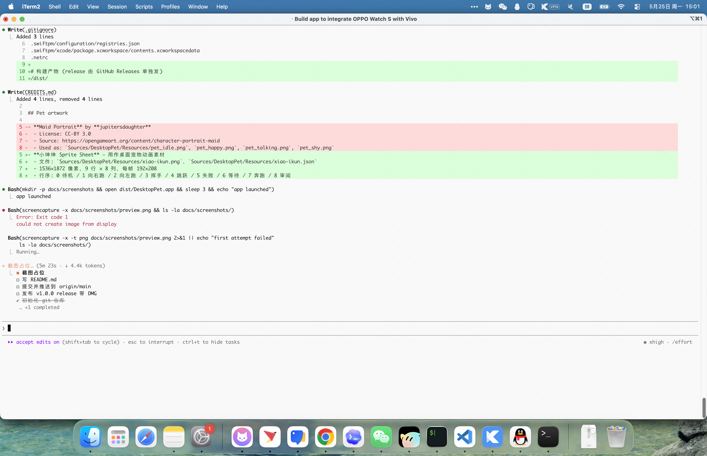

# 桌面小机器人 DesktopPet

一只住在 macOS 桌面右下角的小宠物，会自己走来走去、挥手、跳跃、发呆。  
不在 Dock、不在状态栏，就是一个安静的悬浮窗口。

> 适合一个人写代码的时候，看到屏幕角落有个小东西在动一动，心里不那么空。

## 截图



## 特性

- **完全悬浮**：无 Dock 图标、无菜单栏图标，只是桌面上一个透明小窗口
- **会自己动**：每隔几秒挑一个动作（挥手 / 等待 / 跳 / 跑 / 审阅），演完回到待机
- **可拖动**：按住拖到你喜欢的位置
- **单击互动**：点一下随机触发一个本地动作
- **右键菜单**：收起、退出
- **收起到边缘**：右键 → 收起，会变成屏幕右下角的小竖条；点一下小竖条恢复
- **跑动会自己撞墙转身**：贴着屏幕底边走，撞到左右边缘会反向

## 安装

### 方式一：下载 DMG（推荐）

1. 在 [Releases](https://github.com/guanlongbin/desktop-pet/releases) 页面下载最新的 `DesktopPet-x.y.z.dmg`
2. 双击打开，把 `DesktopPet.app` 拖到 `Applications` 文件夹
3. 启动台找到「桌面小机器人」双击运行
4. 想开机自启 → 系统设置 → 通用 → 登录项 → 「+」加它

> 因为是个人临时签名，第一次运行如果被 Gatekeeper 拦下来：
> 在「系统设置 → 隐私与安全性」最下方点「仍要打开」即可。

### 方式二：源码构建

需要 macOS 13+ 和 Swift 6 工具链（Xcode 15 以上自带）。

```bash
git clone https://github.com/guanlongbin/desktop-pet.git
cd desktop-pet
./build_app.sh
```

脚本会：
- `swift build -c release` 编译 release 二进制
- 在 `dist/DesktopPet.app` 组装好 .app bundle
- 在 `dist/DesktopPet-1.0.0.dmg` 打好 DMG

直接双击 DMG 即可安装。

## 操作

| 操作 | 行为 |
|------|------|
| 单击 | 随机做一个本地动作（挥手 / 跳 / 审阅 / 等待） |
| 拖动 | 移动小机器人到任意位置 |
| 右键 | 弹出菜单：收起 / 退出 |
| 点击右下角小竖条 | 收起后恢复显示 |

## 系统要求

- macOS 13 Ventura 及以上
- Apple Silicon 或 Intel 都可以

## 项目结构

```
Sources/DesktopPet/
├── DesktopPet.swift      # 入口
├── AppDelegate.swift     # 生命周期、点击/右键
├── PetWindow.swift       # 悬浮窗口 + sprite 动画
├── BehaviorDriver.swift  # 自主行为调度
├── CollapseTab.swift     # 收起到边缘的小竖条
└── Resources/
    ├── xiao-ikun.png     # sprite sheet
    └── xiao-ikun.json    # 帧描述
```

## 致谢

见 [CREDITS.md](CREDITS.md)。

## License

MIT
